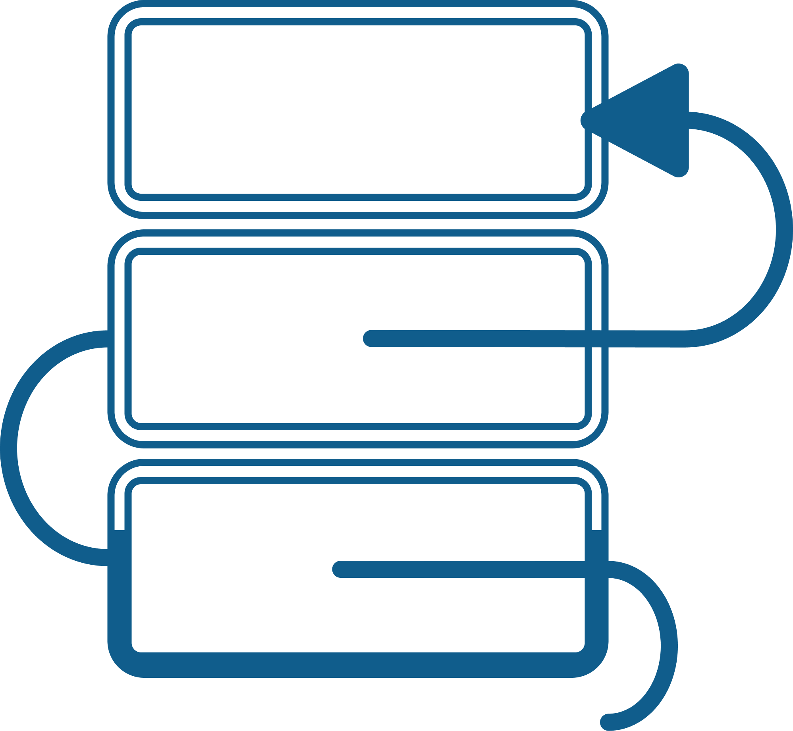

# URM Simulator

[English](README.md)



Simulador visual de **URM (Unlimited Register Machine)**.

O projeto permite montar programas URM em dois formatos:

- modo blocos (interface visual com drag and drop)
- modo texto (editor Monaco com validação de sintaxe)

Também inclui execução passo a passo, execução contínua com controle de velocidade, fita de registradores e destaque da instrução ativa.

## Visão geral

A URM é um modelo teórico de computação baseado em registradores naturais e instruções simples. Este simulador foi criado para estudo e experimentação de programas URM, com foco em feedback visual durante a execução.

## Funcionalidades

- editor em **modo blocos** para criar e reordenar instruções
- editor em **modo texto** com Monaco Editor
- validação de sintaxe em tempo real no modo texto
- autocomplete para `z(n)`, `s(n)`, `t(m,n)` e `j(m,n,q)`
- controles de execução: executar, pausar, passo único e reiniciar
- ajuste de velocidade (ms por passo)
- exibição de `PC`, total de passos e estado da máquina
- fita de registradores com destaque dos registradores tocados
- limite de segurança de passos para evitar loop infinito (`MAX_STEPS = 800`)

## Instruções URM suportadas

- `Z(n)`: zera o registrador `R_n`
- `S(n)`: incrementa `R_n`
- `T(m,n)`: copia o valor de `R_m` para `R_n`
- `J(m,n,q)`: se `R_m = R_n`, salta para a linha `q`

No modo texto, use uma instrução por linha, em minúsculo ou maiúsculo:

```txt
z(0)
s(0)
t(0,1)
j(1,2,6)
```

## Contribuição

Contribuições são bem-vindas.

1. Faça um fork do repositório
2. Crie uma branch: `git checkout -b feat/minha-mudanca`
3. Faça commit das alterações: `git commit -m "feat: adiciona minha mudança"`
4. Envie a branch: `git push origin feat/minha-mudanca`
5. Abra um Pull Request

## Licença

Este projeto está licenciado sob a licença MIT. Veja [LICENSE](LICENSE) para mais detalhes.